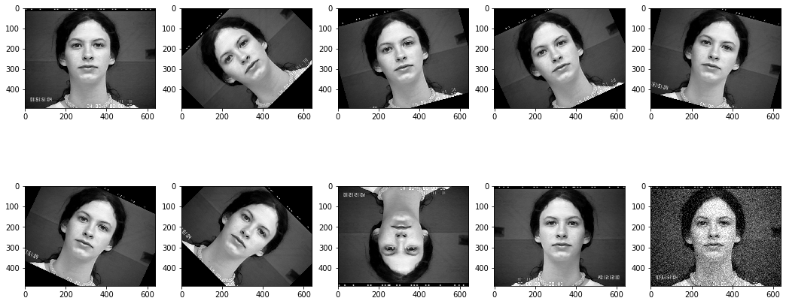
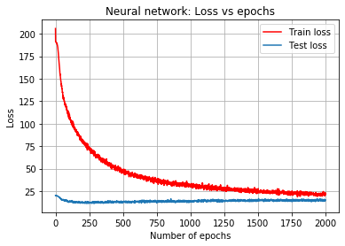
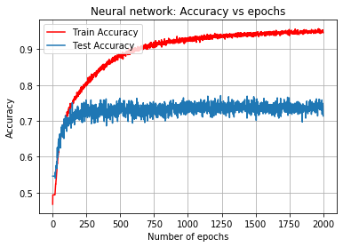
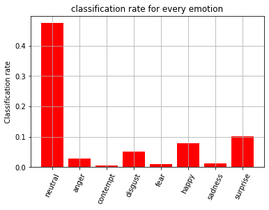
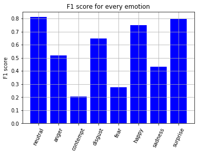

# CK-emotion-classifier
Emotion classifier of the CK+ dataset with a Pytorch CNN with image augmentation and STN. 

Image augmentation: 

The Loss and Accuracy curve:

  

The classification Rate and the F1 score: 

  
